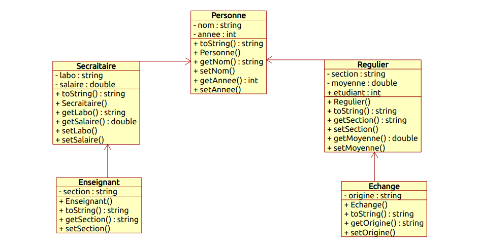

# 🎓 Gestion des ESTiens (POO - Java)

## 📌 Description
Ce projet illustre l’utilisation des **principes de la Programmation Orientée Objet (POO) en Java** à travers un système de gestion des personnes appartenant à une école (ESTiens).  
On y retrouve plusieurs types de personnes : **Secrétaires, Enseignants, Étudiants réguliers et Étudiants en échange**.

---

## 🚀 Fonctionnalités principales
- 👤 **Gestion des personnes** (`Personne`) et de leurs sous-classes.  
- 🔒 **Encapsulation** : chaque attribut est privé (`private`) et accessible via des getters/setters.  
- 🏛 **Héritage** : `Secretaire`, `Enseignant`, `Regulier`, `Echange` héritent de la classe de base `Personne`.  
- 🎭 **Polymorphisme** : surcharge de la méthode `toString()` pour afficher les informations spécifiques selon le type de personne.  
- 🏗 **Constructeurs personnalisés** pour initialiser les objets.  
- 📋 **ArrayList** : gestion dynamique des collections d’objets.  
- 🖥 **Affichage complet** des informations (nom, année, salaire, section, moyenne, origine…).  

---

## 📂 Diagramme de classes
Le projet est basé sur le diagramme UML suivant :  



---

## 📦 Technologies utilisées
- ☕ **Langage** : Java 24.0.2 (JDK 24)  
- 🛠 **IDE** : Eclipse  
- 🧩 **Paradigme** : POO *(héritage, encapsulation, polymorphisme, abstraction)*  
- 📋 **Collections** : ArrayList  
- 🗂 **UML** : Umbrello  
  ```bash
  sudo apt install umbrello -y
