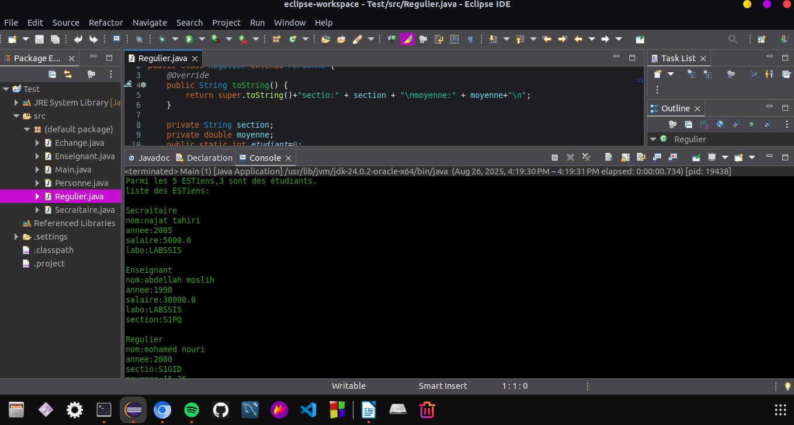

🎓 Gestion des ESTiens (POO - Java)
📌 Description
🚀 Fonctionnalités principales

Gestion des personnes (Personne) et de leurs sous-classes.

Utilisation des concepts POO :

Encapsulation : chaque attribut est privé (private) et accessible via des getters/setters.

Héritage : Secretaire, Enseignant, Regulier, Echange héritent de la classe de base Personne.

Polymorphisme : surcharge de la méthode toString() pour afficher les informations spécifiques selon le type de personne.

Constructeurs personnalisés dans chaque classe pour l’initialisation.

Gestion dynamique des objets avec une ArrayList.

Affichage des informations sur les personnes (nom, année, salaire, section, moyenne, origine…).

📂 Diagramme de classes

📦 Technologies utilisées
Langage : java 24.0.2(JDK 24)

IDE : Eclipse

Paradigme : POO (héritage, encapsulation, polymorphisme, abstraction)

Collections : ArrayList
UML   : Umbrello (sudo apt install umbrello -y)

Exécution 

